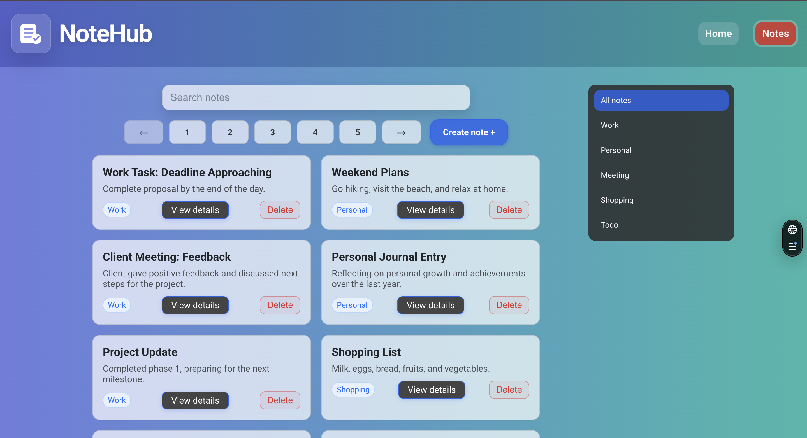
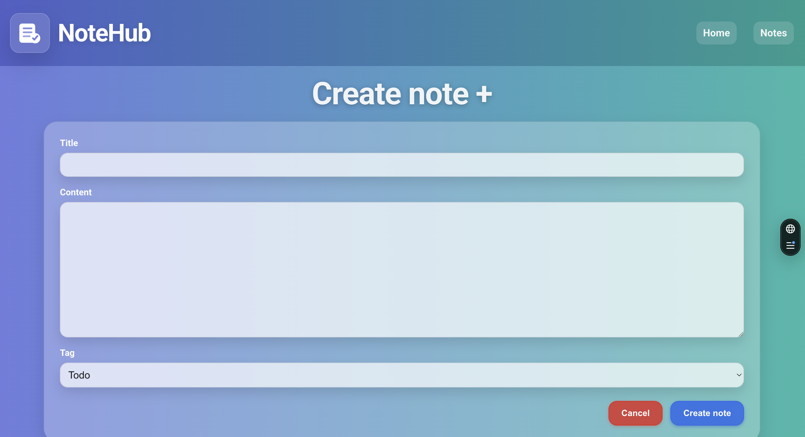

🚀 NoteHub — Modern Note Manager

A clean, fast and elegant note-taking app to organize your ideas and stay productive.

🌐 **Live Demo:**  
https://note-hub-drab.vercel.app/

📸 Screenshots

🏠 Home Page

🔎 Notes Page

🎥 Create Page

✨ Highlights

✔ Lightning-fast UI  
✔ Auto-saving drafts  
✔ Persistent state after refresh  
✔ Clean modern design  
✔ Server + Client architecture  
✔ Optimized data fetching

🧩 Features

- 📝 Create notes with title, content, and tag
- 🏷 Tag filtering system
- 🗑 Delete notes instantly
- 💾 Draft autosave while typing (Zustand)
- 🔁 Draft restored after refresh (localStorage persist)
- ↩ Cancel keeps progress
- ✅ Submit clears draft
- 🔄 Auto list refresh after mutations
- 📱 Responsive design
- 🌐 SEO + Social preview metadata

🧠 Draft Autosave System

NoteHub never lets you lose work.
Every keystroke updates global state:
input change → Zustand store → persist → localStorage

Flow:

1. User types → draft updates
2. Page reload → draft restored
3. Cancel → draft kept
4. Submit → draft cleared

⚙️ Tech Stack

Technology Purpose
Next.js App Router Framework
TypeScript Type safety
React Query Server state
Zustand Global state
Persist middleware Draft storage
CSS Modules Styling
🔄 Smart Data Sync

After create/delete actions:
mutation → cache invalidate → refetch → UI updates
No page reload needed.

🧱 Architecture Philosophy

This project demonstrates modern frontend architecture principles:
separation of server/client logic
predictable state
cache synchronization
persistent UI state
scalable folder structure

📁 Project Structure

app/
└─ notes/
├─ page.tsx
└─ action/create/page.tsx
components/
├─ NoteForm
└─ NoteList
lib/
├─ api
└─ store
types/

🚀 Getting Started

Clone project
git clone https://github.com/Anastasiia-git/NoteHub.git
cd movie-explorer
Install dependencies
npm install
Run locally
npm run dev

🔑 Environment Variables

Create .env file in root:
VITE_API_KEY=your_api_key_here
⚠️ Never commit API keys.

🛣 Roadmap

- ✏ Edit notes
- 🔍 Search notes
- 📊 Pagination improvements
- 🌙 Dark mode
- 🔐 Auth system
- 📊 Metadata Support

Includes full social preview support:

OpenGraph tags
Twitter card
Preview image
SEO title + description

👨‍💻 Author

Anastasiia Totska
GitHub → https://github.com/Anastasiia-git

📄 License

Educational project — free to use for learning purposes.
