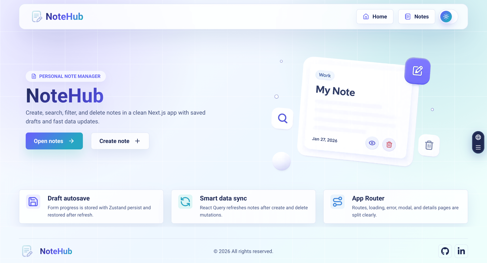
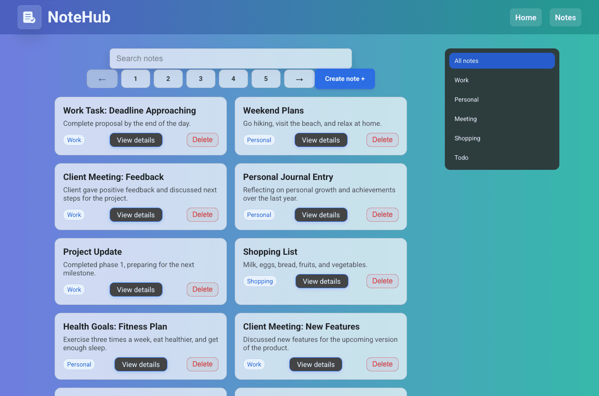
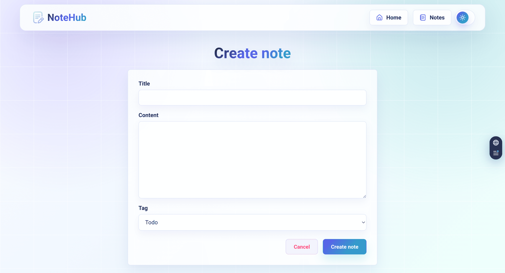

# NoteHub

A clean note manager built with Next.js App Router, TypeScript, React Query, and Zustand.

Live demo: https://note-hub-drab.vercel.app/

## Screenshots

### Home



### Notes



### Create Note



## Why This Project Is In My Portfolio

NoteHub shows the frontend skills I want recruiters to notice:

- routing with Next.js App Router
- typed API requests with Axios and TypeScript
- server-state handling with React Query
- draft autosave with Zustand persist
- search, tag filtering, pagination, create, details, and delete flows
- loading and error states
- responsive CSS Modules without a UI framework
- SEO and social preview metadata

## Features

- Create notes with title, content, and tag
- Search notes by keyword
- Filter notes by tag
- Open note details in a separate route
- Delete notes from the list
- Autosave the create-note draft in localStorage
- Refresh note data after create and delete actions
- Responsive layout for desktop, tablet, and mobile

## Tech Stack

- Next.js
- React
- TypeScript
- TanStack React Query
- Zustand
- Axios
- CSS Modules

## Getting Started

Clone the project:

```bash
git clone https://github.com/Anastasiia-git/NoteHub.git
cd NoteHub
```

Install dependencies:

```bash
npm install
```

Create `.env.local` in the project root:

```bash
NEXT_PUBLIC_NOTEHUB_TOKEN=your_token_here
```

Run locally:

```bash
npm run dev
```

## Available Scripts

```bash
npm run dev
npm run build
npm run start
npm run lint
```

## Project Structure

```text
app/
  notes/
    action/create/
    filter/
    [id]/
components/
  Header/
  Footer/
  NoteForm/
  NoteList/
  Pagination/
  SearchBox/
lib/
  api.ts
  store/
types/
  note.ts
```

## Next Improvements

- Edit existing notes
- Better empty-state UI
- Authentication
- Dark mode

## Author

Anastasiia Totska  
GitHub: https://github.com/Anastasiia-git
